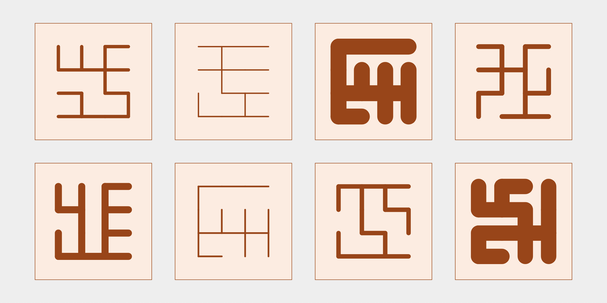

## Script-like patterns on the square lattice

My first idea was to try drawing on the square lattice.
These are some of the earliest pieces:

When I posted them in a Discord, [the6p4c](https://the6p4c.github.io) said they looked like "odd pictograms from a [conlang](https://en.wikipedia.org/wiki/Constructed_language)".
I ran with that idea, and gave them an earthy tone and varying stroke width, which remind me of some of the Chinese I've read:

